# Fractalio

Project to the subject PGR - rendering fractals.

- [Controls](#controls)
- [Fractals](#fractals)
    - [Set fractals](#set-fractals)
        - [Mandelbrot set](#mandelbrot-set)
        - [Julia set](#julia-set)
        - [Powerbrot](#powerbrot)
        - [Burning ship](#burning-ship)
        - [Burning julia](#burning-julia)
    - [Newton](#newton)
    - [Chaotic fractals](#chaotic-fractals)
        - [Double pendulum](#double-pendulum)
        - [Three body](#three-body)
        - [Gravity basins](#gravity-basins)
    - [Littlewood](#littlewood)

## Controls

```
Drag with left mouse button to move (even here in help ;). Drag with right
mouse button (up/down) to change the scale.

Fractalio uses vim like commands. The command structure is:
  <modifier><count><command>
    <modifier> may be one of: `+`, `-`, `*`, `/`, `=`.
    <count> is signed floating point number.
Commands will be executed immidietelly after they are typed. You can confirm
command sooner by pressing <enter>. Pressing <escape> will cancel the
partially type command. The special commands starting with `:` will be
executed only after pressing enter.

Commands:
  `?` `gh` `:h` `:help`
         Show this help.
  <esc>  Cancel currently typed command. If there is no such command, make
         the base fractal focused.
  :fractal
         Give command focus to the base fractal.
  <space>  :picker
         Give command focus to the picker (if present).
  <tab>  Toggle single/double precision.
  `r`<char>
         Reset configuration of fractal. The next character will decide what
         should be reset. Available options are `r` - reset all parameters
         except scale and position, `p` - reset position and scale, char
         corresponding to parameter to reset (`i`, `c`, `x`, `y`, `z`).
  `R`    Reset
  `:x` `:exit` `:q`  `:quit`
         Exit.
  `;`    Repeat the last command.
  `::`<characters>
         Simulate the press of the following characters.
  `z`    Set scale.
  `i`    Set number of iterations.
  `c`    Set number of colors.
  `x`    Set x (real) coordinate.
  `y`    Set y (imaginary) coordinate.
  `t`    Set time.
  `s`    Set maximum step size.
  `v`    Set simulation speed.
  `:vsync`  <int>
         Enable/disable vsync. (0 disable, 1 enable)
  `:fps` <int>
         Limit the fps.
  `g`<char>
         Go to the given fractal:
           `h`: Help
           `m`: Mandelbrot set
           `j`: Julia set
           `s`: Burning ship
           `n`: Newton fractal
           `p`: Double pendulum
           `l`: Littlewood
  <number>`G`
         Go to fractal/page identified by number:
           0: Help
           1: Mandelbrot set
           2: Julia set
           3: Burning ship
           4: Powerbrot
           5: Newton fractal
           6: Burning julia
           7: Double pendulum
           8: Three body
           9: Gravity basins
           10: Littlewood
  :flags <mask> <value>
         Set flags of the current fractal. Mask is bit mask of bits that will
         be set, value is the value of the bits. The meaning of the bits is
         dependant on the fractal, but usually the lowest 4 bits are coloring
         type.
  :flag <name>
         Named equivalient of :flags. Names are defined per fractal.
  :grad1  :gradient1 <gradient-name>|[<size>@]<color-points>
         Select/define gradient. Selectible gradients:
           `ultra-fractal`  blue - white - yellow - black - blue (default)
           `grayscale`      black - white - black
           `burn`           red - yellow - white - black - red
           `monokai`        pink - yellow - green - blue - pink
           `rgb`            red - green - blue - red
           `cmy`            cyan - magenta - yellow - cyan
         Color points format: comma separated pairs of index:#rrggbb. Index
         is value from 0 to 1. Size is the resolution, default is 256.
  :par  :parameter [index] <x> <y>
         Set value of a parameter. The default index is 0. Using idex larger
         than the current number of parameters will add new parameters up to
         that index.
  :set <name> [<x> [<y>]]
         Set attribute given by name. If there is no value, it will reset the
         value to default.
  :save [filename]
         Save the current configuration to a file. `-` is stdout. If file is
         not present, save to clipboard.
  :load [filename]
         Load configuration from file. `-` is stdin. If file is not present,
         load from clipboard.
  :precision 1|2
         Set precision to single or double.
```

## Fractals

### Set fractals.

The view is complex plane; each pixel represents a complex number. The pixel is
colored by the properties of the complex number. The fractal represents set of
complex numbers. Complex number $p$ belongs to the set if
$x_{n+1}=f(x_n, p, \theta)$ is bounded as $n \rightarrow \infty$ for some given
$f(x, p, \theta)$ where $p$ is number given by the pixel position and $\theta$
is vector of parameters.

In most cases, it is true that if $|x_n| > B$ than $p$ doesn't belong to the
set. In practice there is maximum iteration limit after which the number will
be considered part of the set.

If number given by the pixel belongs to the set, it is colred black. If it
doesn't belong to the set, it is colored based on the value of $n$ for the
first $x_n > B$. The color is chosen from a gradient.

Showcase of how the fractal forms with increasing the maximum number of
iterations on mandelbrot set:


Flags availeble for set fractals (showcased on mandelbrot set):
- `0xF`: Coloring method:
  - `0x0`, `basic`: Basic stepped coloring.
  - 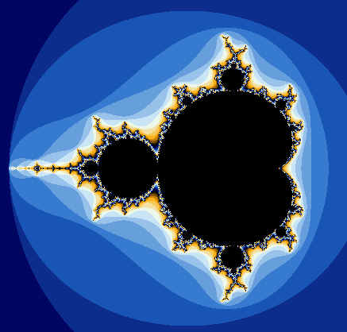
  - `0x1`, `smooth`: Smooth coloring (smoothing is not perfect).
  - 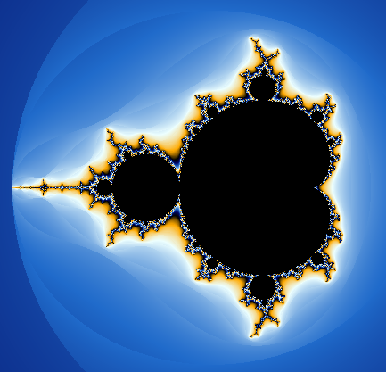
  - `0x2`, `shade-step`: Shade gradient steps.
  - 
  - `0x3`, `color-step`: Color gradient steps.
  - 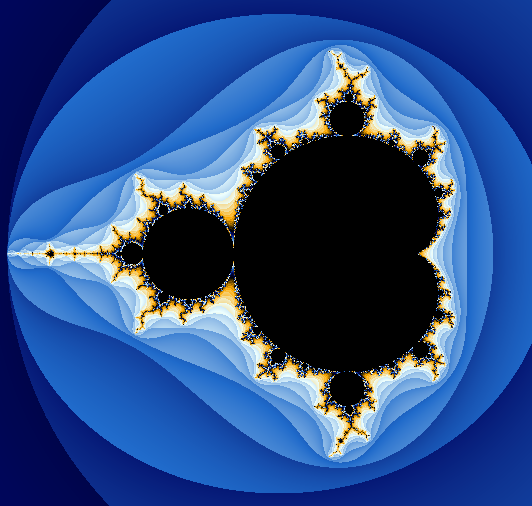
  - `0x4`, `log-shade-step`: Shade gradient steps with logarithmic color
    change.
  - 

#### Mandelbrot set

$$x_0 = 0$$
$$x_{n+1} = x_n^2+p$$
$$B = 2$$

Overall fractal:


Zoomed part:


Zoom process:


#### Julia set

$$x_0 = p$$
$$x_{n+1} = x_n^2 + \theta$$
$$B = 2$$

Transofrmation of the set with change of the parameter $\theta$


Julia for one of the parameters:

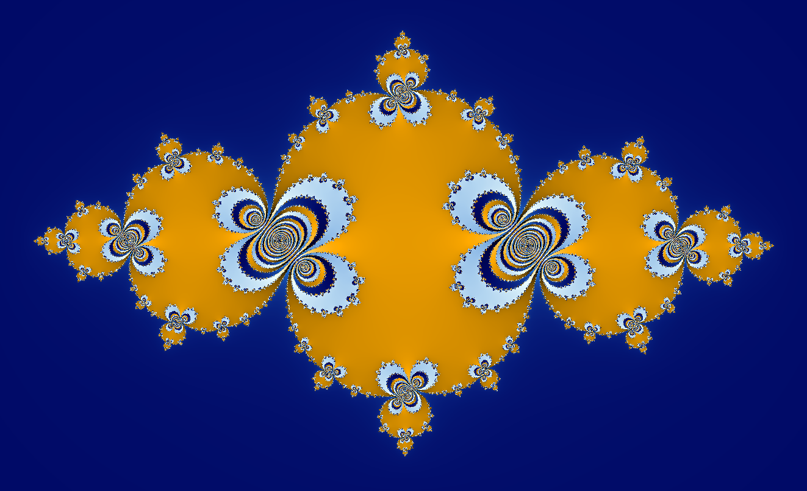

#### Powerbrot

$$x_0 = 0$$
$$x_{n+1} = x_n^\theta + p$$
$$B = max(|\theta|, 2)$$

Note that the value of $B$ is not correct from the view of derermining the set
of numbers because for some values of $\theta$ the set contains all the complex
numbers.

This is equivalent to mandelbrot set when $\theta = 2$. The reason that this is
separate fractal is that this generic version is much harder to compute and so
it is more limiting when trying to zoom in (only single precision, more
demanding).

Showcase of how the fractal changes with the parameter $\theta$ first in real
positive values and than in complex values:


#### Burning ship

$$x_0 = 0$$
$$x_{n+1} = |\Re(x_n^2 + p)| + i|\Im(x_n^2 + p)|$$
$$B = 2$$

Overall fractal:

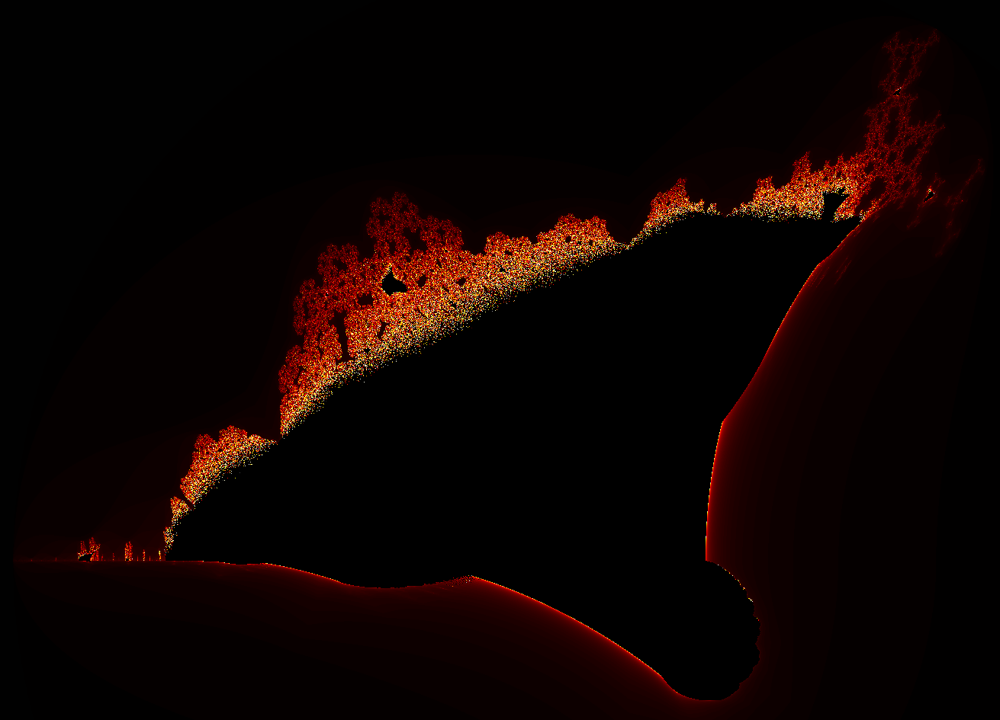

Zoomed portion:

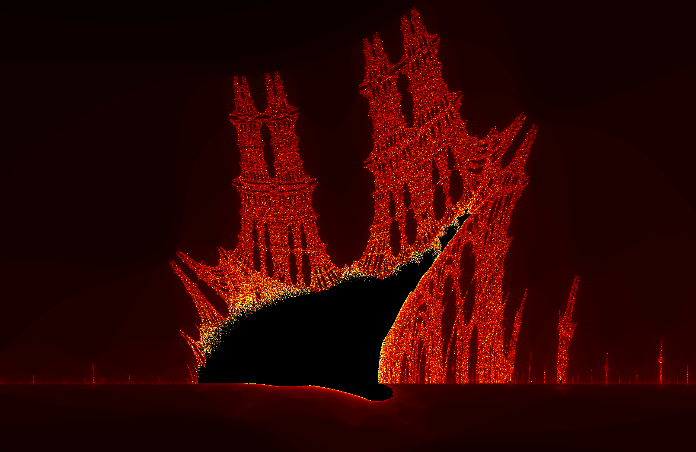

#### Burning julia

$$x_0 = p $$
$$x_{n+1} = |\Re(x_n^2 + \theta)| + i|\Im(x_n^2 + \theta)| $$
$$B = 2 $$

Showcase of how the fractal changes with change of the parameter $\theta$:


Burning julia for one of the parameters $\theta$:

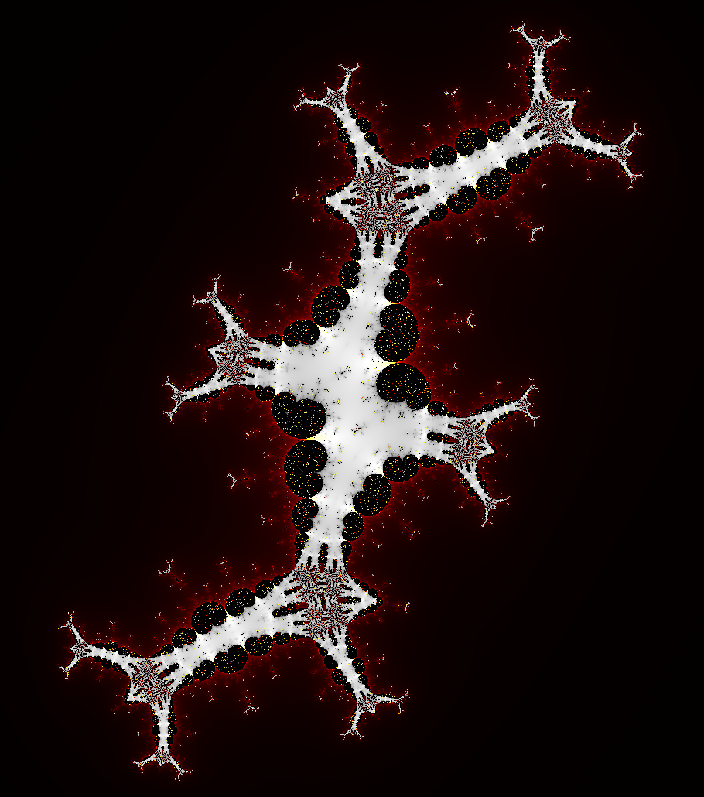

Zoom into fractal with the same $\theta$:

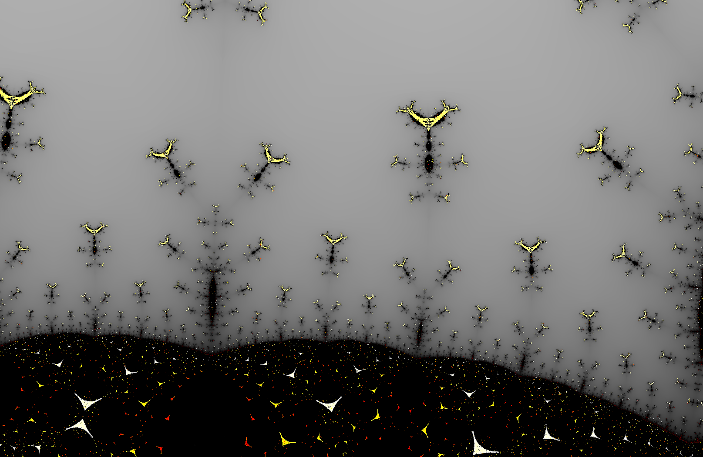

### Newton

The newton fractal shows complex plane. Each pixel coresponds to a complex
number and it is colored according to how that number behaves.

Newton's fractal is defined by a polynom $f(x) = (x-r_0)(x-r_1)...(x-r_n)$
where $r_m$ is the mth root of the polynom. To show the fractal we use the
number given by pixel position as initial estimate of a root when finding root
of the polynom with newton's method. The color of the pixel is given by the
root wich is found and how fast is the root found.

The newton's method for finding root of a polynomial with initial estimate
$x_0$ is:

$$x_{m+1}=x_m- \frac{f(x_m)}{f'(x_m)}$$

Flags available for newton's fractal:
- `0xF`: coloring method:
  - `0x0`, `flat`: color is given by the final root
  - 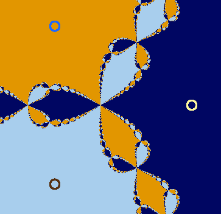
  - `0x1`, `bright`: color is given by the final root and is brighter for roots
    that took longer to find.
  - 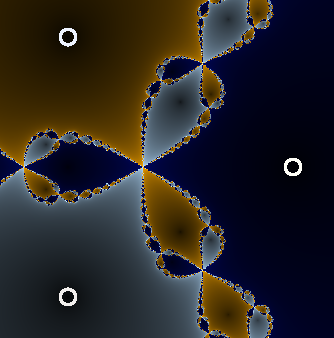
  - `0x2`, `dark`: color is given by the final root and is darker for roots
    that took longer to find.
  - 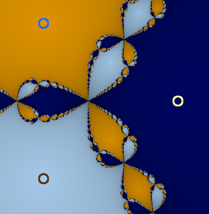
  - `0x3`, `iter`, `iteration`: color is given by how long it took to find the
    root
  - 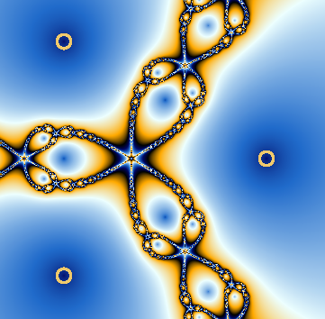
  - `0x4`, `log-iter`, `log-iteration`: color is given by logarithm of how long
    it took to find the root.
  - 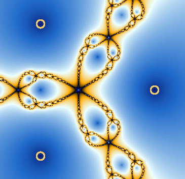
- `0x10`, `smooth`: enable/disable smooth coloring
- 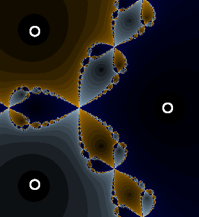
- `0x20`, `overlay`, `par`, `parameters`: enable/disable parameter position
  overlay
- 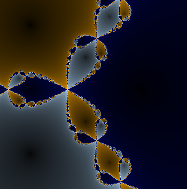

Showcase of how the fractal changes by changing the position of roots and
adding more roots:


### Chaotic fractals

Chaotic fractals simulate some systems using a simulation method. The
simulation method uses state update function $f(S_t) \rightarrow S_\Delta$
that approximates the state change $S_\Delta$ at the current time $t$ with
state $S$. Implemented methods are eulers method:

$$S_{t+h}=S_t + h f(S_t)$$

and runge-kutta 4:

$$S_{t+h} = S_t + \frac{h}{6}(k_1 + 2k_2 + 2k_3 + k_4)$$

where

$$k_1 = f(S_t)$$
$$k_2 = f(S_t + \frac{h}{2}k_1)$$
$$k_3 = f(S_t + \frac{h}{2}k_2)$$
$$k_4 = f(s_t + h * k_3)$$

Flags available for the chaotic fractals:
- `0xF0`: simulation method
  - `0x0`, `euler`: euler method
  - `0x10`, `rk4`, `runge-kutta4`: runge-kutta 4 method

#### Double pendulum

The double pendulum fractal shows configuration plane of double pendulum. Each
pixel represents double pendulum system configured based on the pixel location.
Color of the pixel depends on the configuration. Each system is than simulated
and the fractal forms from how different confiugrations of double pendulums
behave.

The double pendulum is simulated using the following definition of
$f([\theta_1, \theta_2, \theta'_1, \theta'_2], h) \rightarrow [\theta_{1\Delta}, \theta_{2\Delta}, \theta'_{1\Delta}, \theta'_{2\Delta}]$:

$$\theta_{1\Delta} = \theta'_1$$
$$\theta_{2\Delta} = \theta'_2$$
$$\theta'_{1\Delta} = \theta''_1$$
$$\theta'_{2\Delta} = \theta''_2$$

where

$$\theta''_1 =\frac{-g(2m_1 + m_2)sin(\theta_1) - m_2g sin(\theta_1-2\theta_2) - 2sin(\theta_1-\theta_2)m_2(L_2\theta'^2_2+L_1\theta'^2_1cos(\theta_1-\theta_2))}{L_1(2m_1+m_2(1-cos(2(\theta_1-\theta_2))))}$$
$$\theta''_2 = \frac{2sin(\theta_1-\theta_2)(L_1\theta'^2_1(m_1+m_2) + cos(\theta_1)g(m_1+m_2) + L_2m_2\theta'^2_2cos(\theta_1+\theta_2))}{L_2(2m_1+m_2(1-cos(2(\theta_1-\theta_2))))}$$

where $\theta_1$ and $\theta_2$ are the angles of the pendulums, $\theta'_1$
and $\theta'_2$ are the angular velocities of the pendulums, $\theta''_1$ and
$\theta''_2$ are the angular accelerations of the pendulums, $m_1$ and $m_2$
are the masses of the points at the end of the pendulums, $L_1$ and $L_2$ are
the lengths of the pendulums and $g$ is the gravitational constant.

Flags available for double pendulum fractal:
- `0xF`: coloring
  - `0x0`, `pos`, `position`: The angles are used as coordinates to a 2D
    texture.
  - 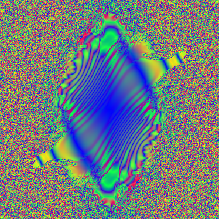
  - `0x1`, `speed`, `velocity`, `vel`: The velocities are used as coordinates
    to a 2D texture (edges clamp to black).
  - 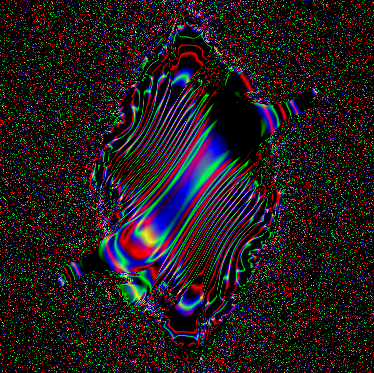
  - `0x2`, `acc`, `acceleration`: The accelerations are used as coordinates to
    a 2D texture (edges clamp to black).
  - 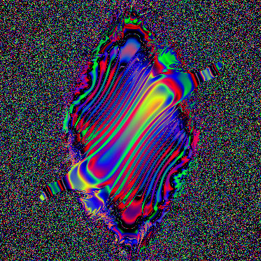
- `0x100`, `init-position`: toggle between init position and init velocity
  - position
  - 
  - velocity
  - 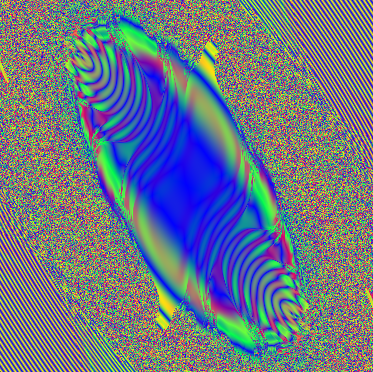

How the fractal evolves with position initialization:


How it evloves with velocity initialization:


#### Three body

The three body fractal shows configuration plane for three body system. Each
pixel represents different configuration. Two bodies have fixed position given
by parameters. The third body position is the same as the pixel position. Each
body also has small initial velocity in direction given by the vector of
position difference of the other two bodies.

Three body is simulated using the following definition of
$f([[x_1, x'_1], ..., [x_n, x'_n]]) \rightarrow [[x_{1\Delta}, x'_{1\Delta}], ...]$
where $n=3$:

$$x_{b\Delta} = x'_b$$
$$x'_{b\Delta} = x''_b$$

where

$$x''_b = \sum_i^{n; i \ne b}(x_i-x_b)\frac{g m_i}{|x_i-x_b|^2+\epsilon}$$

where $x_b$ is vector with position of the bth body, $x'_b$ is velocity of the
bth body, $x''_b$ is acceleration of the bth body, $m_b$ is mass of the bth
body, $g$ is gravitational constant and $\epsilon$ is a small value sabilizing
the simulation.

Flags available for three body fractal:
- `0xF`: coloring
  - `0x0`, `relative-distance`, `rel-dist`: color components are relative
    distances of the bodies.
  - 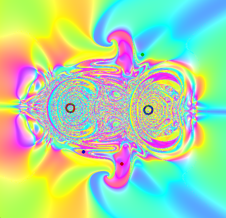
  - `0x1`, `dist`, `distance`: color components are distances from the origin
  - 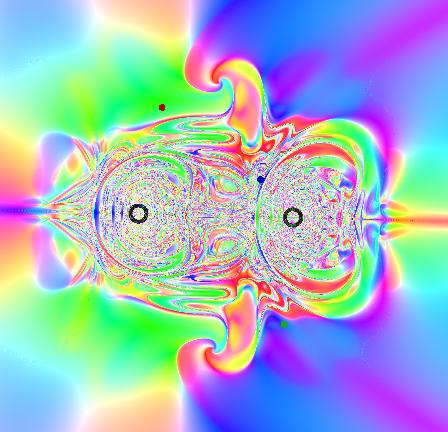
  - `0x2`, `vel`, `velocity`, `speed`: color components are velocities
  - 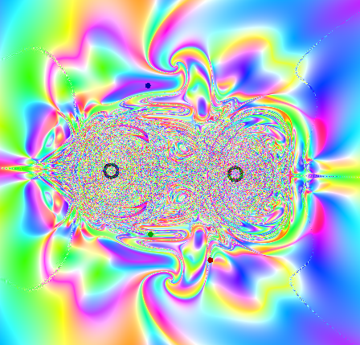
  - `0x3`, `angle`: color components are angles around the origin
  - 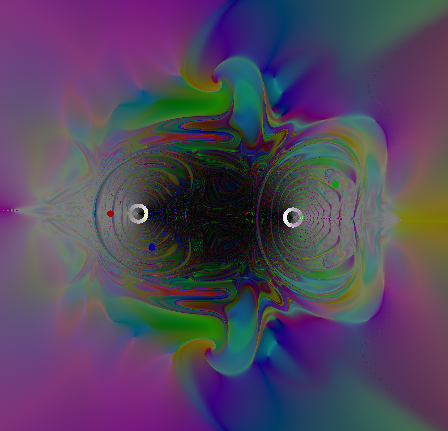
  - `0x4`, `relative-angle`, `rel-angle`: color components are angle around the
    average position
  - 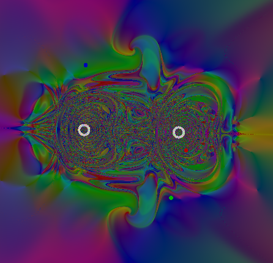
  - `0x5`, `closest-angle`: color components are angles to the closest body
  - 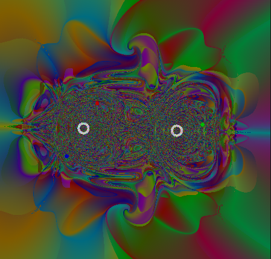
- `0x100`, `relative`, `rel`: toggle relative body positiononing
- `0x200`, `par`, `overlay`: toggle initial body positoin overlay
- 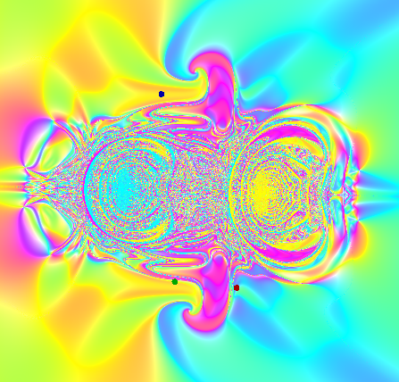

Showcase of how the fractal evolves with time and than moving initial
positions:


#### Gravity basins

The gravity basins fractal shows system with $N$ fixed bodies and one movable.
Each pixel represents system where the starting position of the movable body is
at the pixel position. The color is determined by the closest body after given
time.

Gravity basins is simulated using the following definition of
$f([x, x']) \rightarrow [x_\Delta, x'_\Delta]$:

$$x_\Delta = x'$$
$$x'_\Delta = x''$$

where

$$x'' = \sum_i^N(x_i-x)\frac{g m_i}{|x_i-x|^2+\epsilon}$$

where $x_i$ is vector with position of the ith body, $x'$ is velocity of the
ith body, $x''$ is acceleration of the ith body, $m$ is mass of the ith body,
$g$ is gravitational constant and $\epsilon$ is a small value sabilizing the
simulation.

Showcase of how gravity basins evolves over time and than moving and adding
the fixed bodies:


### Littlewood

The littlewood fractal is histogram of roots of nth degree polynomials of the
form $f(x)=c_0+c_1x^1+...+c_nx^n$ where the coefitients $c$ can take any
complex number from given list of numbers. Plotting all the roots of all
possible polynomials of degree $n$ with the given coefitient list forms the
littlewood fractal.

The polynomials are generated in order and the color of the roots they give is
given by position within this ordered sequence.

I implemented two methods for finding all the roots $r$ of given polynomial
$f$. They are the Arbeth method:

$$r_{k,i+1} = r_{k,i} - \frac{\frac{f(r_{k,i})}{f'(r_{k,i})}}{1-\frac{f(r_{k,i})}{f'(r_{k,i})}\sum_j^{N;j \ne k}\frac{1}{r_{k,i}-r_{j,i}}}$$

and Durnad-Kerner method:

$$r_{k,i+1} = r_{k,i} - \frac{f(r_{k,i})}{\prod_j^{N;j \ne i}(r_{k,i}-r_{k,j})}$$

The Arbeth method is overall better because its convergence speed to
computation complexity ratio is larger.

Flags available for littlewood fractal:
- `0xF`: coloring
  - `0x0`, `forward`: order the normal way
  - 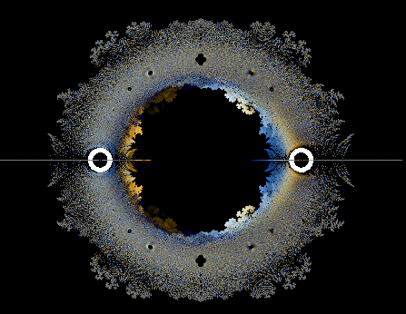
  - `0x1`, `backward`: inverse the order
  - 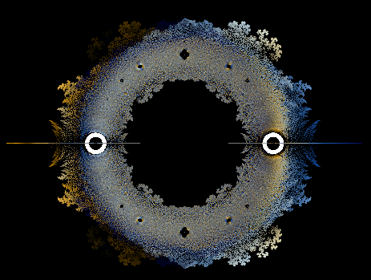
- `0xF0`: root finding method
  - `0x0`, `abeth`: arbeth method
  - `0x1`, `dk`, `durnard-kerner`: durnard-kerner method
- `0x100`, `const`: enable/disable fixing c0 to 1
- 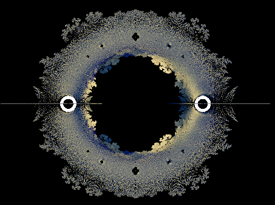
- `0x200`, `par`, `overlay`: enable/disable coefitient list overlay
- 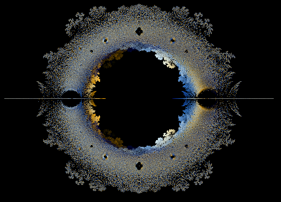

The overall fractal with coefitients 1 and -1:

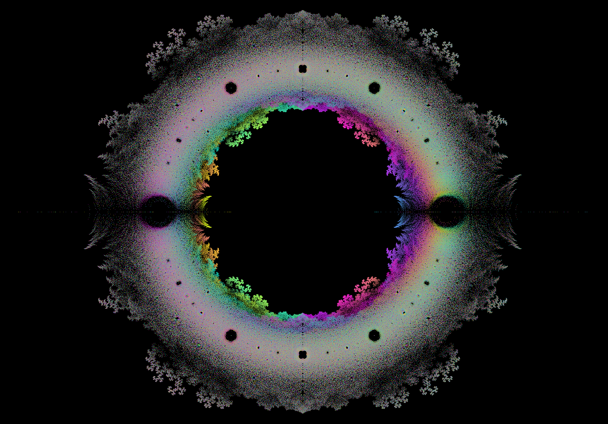

Serpinski triangle within littlewood fractal when using 4 coefitients:

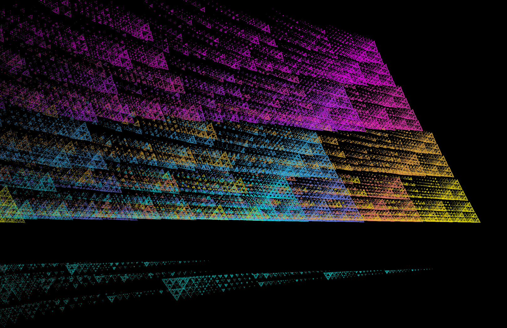

And zoomed out version over the whole fractal with serpinski triangle:

